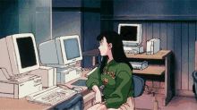

  

### Konnichiwa! Welcome to my digital realm! 

  

## � About This Code Wizard

- 🎓 **Computer Science Student** at **Bandung Institute of Technology** (Third Year)
- 💻 Passionate about **Web Development**, **Mobile Apps**, **AI & ML** 
- 🌱 Currently diving deep into **Machine Learning** and **Full-Stack Development**
- 🎯 Always exploring new tech stacks and building cool projects
- 🎮 Fun fact: I debug code better with anime music on! 
- ⚡ Goal: Transform caffeine into clean code ☕→💻

## 🌐 Let's Connect!

   

  

## 💻 Tech Arsenal & Battle Weapons

### 🔥 Programming Languages
 
 
 
 

### ☁️ Cloud & Backend Magic
 
 

### 🌐 Frameworks & Libraries  
 
 
 
 
 

 
 

### 🗄️ Databases
 
 

### 🤖 AI/ML & Data Science
 
 
 
 
 

### 🎨 Design & Creative Tools
 
 
 
 

### 🛠️ Development Tools
 
 
 
 
 

### 🔧 Hardware & IoT
 

  
   
  <i>literally me when coding at 2am...</i>

## 🎭 College Task Momentos - *My Anime Journey*

### IRK Task Momentos

 
<i>literally me during IRK assignments...</i>

### LabPro Task Momentos  

 
<i>literally me debugging lab projects...</i>

### Sister Task Momentos

 
<i>literally me mentoring juniors...</i>

### BasDat Task Momentos

 
<i>literally me writing SQL queries...</i>

## 📊 GitHub Analytics & Battle Stats

  
   
  <i>Collecting GitHub XP points...</i>

  

## 🏆 Achievement Unlocked!

  

   <b>Current Status:</b> <i>Turning coffee into code...</i> 

  
   
  <i>literally me saying goodbye...</i>

