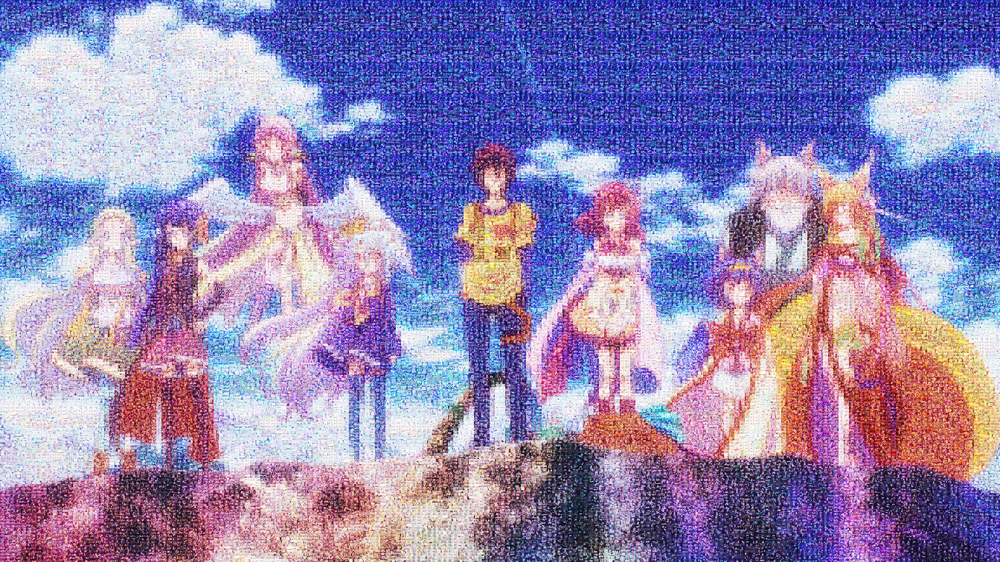
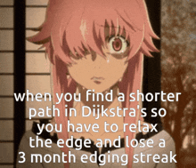
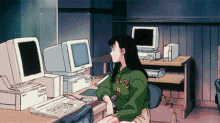
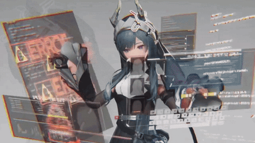
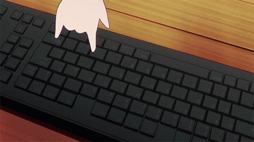

<div align="center">
  
</div>

### Konnichiwa! Welcome to my digital realm! 

<div align="center">
  
</div>

<div align="center">
  


</div>

<!--  -->

## About Me

<!-- - **Computer Science Student** at **Bandung Institute of Technology** (Third Year)
- Passionate about **Web Development**, **Mobile Apps**, **AI & ML** 
- Currently diving deep into **Machine Learning** and **Full-Stack Development**
- Always exploring new tech stacks and building cool projects
- Fun fact: *meh~* -->


```zsh
> nano rlukassa 
```

 

```csharp
>> rlukassa@github.com                       [ver. March 2026]
-------------------------
Pronouns      : He/Him
Location      : Indonesia - Worldwide
Major         : Computer Science @ ITB (Final Year)
Passionate    : Fullstack Development, AI/ML 
Projects now  : SWE @ ??? [REDACTED as NDA] 
Currently into: AWS Cloud Computing and Infrastructure 
Specialized   : Angular, Ruby on Rails, AWS  
Fun fact      : ~meh

``` 

## Let's Connect!

[](https://instagram.com/rlukassa) [](https://www.linkedin.com/in/lukas-raja-agripa-0365372a5/) [](https://quora.com/profile/Lukass.) [](mailto:lukasagripa27@gmail.com)


## Tech Arsenal & Battle Weapons

### Programming Languages
<p>
  
</p>

### Cloud & Backend 
<p>
  
</p>

### Frameworks & Libraries  
<p>
  
</p>

### Databases
<p>
  
</p>

### AI/ML & Data Science
<p>

</p>

### Design & Creative Tools
<p>
  
</p>

### Development Tools
<p>
  
</p>

### Hardware & IoT
<p>
  
</p>


## College Task Momentos - *On a Anime GIF*
<i> hanya kepingan yang pernah terjadi -- just to keep the moments saved <i>

<div align="center">

### IRK Task Momentos

<br>
<i>Me questioning my life during IRK assignments...</i>

### Labpro Task Momentos  

<br>
<i>Me on data structures and oop projects... </i>

### Sister Task Momentos

<br>
<i>Me trying to connect on computer network...</i>

### Basdat Task Momentos

<br>
<i>Me writing SQL queries on docs and linux ubuntu while see the database scheme...</i>

### AI Task Momentos

<br>
<i>Me doing a practicum with my partner in the same colab notebook</i>

### RPL Task Momentos

<br>
<i>Ughhhh documeeent... Yapping time :D</i>

</div>

## Achievement Unlocked!

<div align="center">
   <b>Current Status:</b> <i>Turning coffee into code...</i> 
</div>

<div align="center">
  
  <br>
  <i>Hanupis!</i>
</div>